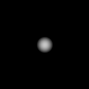
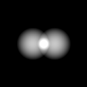

# Heightmap Analysis Framework (WIP)

## Core Philosophy
A heightmap is a 2.5D scalar field: perfect geometric surface information, zero information about what lies above, 
below, or what the surface means. Analysis must proceed from fundamental mathematics to derived semantics.

The plan of attack is to generate `Ground Truth Validation` using `synthetic terrain`  to generate heightmaps with known features.  

   

Compare detected output features against ground truth will calibrate our model, using predefined config parameters located `core.py`.  

## Pipeline Architecture

| Layer | Name | Output | Key Parameters | Dependencies |
|:-----:|------|--------|----------------|--------------|
| **0** | **Calibration** | Clean Surface | `h_scale=2.0 m/px` `v_scale=0.2 m/unit` `noise_sigma=2.0` | Raw heightmap |
| **1** | **Local Geometry** | Slope (0-90°) Aspect (0-360°) | `gradient_method=central` `flat_threshold=0.5°` | Layer 0 |
| **2** | **Regional Geometry** | Mean Curvature H Gaussian Curvature K 6-Type Classification | `H_eps_min=1e-4` `K_eps_min=1e-5` `adaptive=True` | Layer 1 |
| **3** | **Topology** | Peaks ▲ Ridges ━ Valleys ━ Saddles ● Flat Zones ■ | `peak_prominence=2m` `ridge_length=6px` `saddle_K=2e-4` `flat_slope=3°` | Layer 2 |
| **4** | **Relational** | Visibility Graph Flow Network Connectivity Graph | `vis_range=1200m` `conn_radius=200m` `flow_step=10px` | Layer 3 |
| **5** | **Semantics** | Defensive Positions Observation Points Assembly Areas Chokepoints | `def_prominence=8m` `obs_visibility=10` `assembly_area=2000m²` | Layer 4 |

# Early Testing

---

## The Analysis Pipeline

### Layer 0: Calibration (The Observable)
*Before examining data, define the measurement context.*

- **Input:** Raw grayscale image (0-255)
- **Operations:**
  - Normalize values (convert to real-world units if metadata available)
  - Apply noise reduction (Gaussian blur)
- **Rationale:** Calculus on noisy data produces unusable derivatives. Every pixel fluctuation becomes a false feature.
- **Output:** Clean mathematical surface ready for analysis

### Layer 1: Local Geometry (First Derivatives)
*How does the surface behave at this exact point?*

- **Input:** Calibrated surface
- **Operations:**
  - Calculate gradient magnitude → **Slope** (steepness)
  - Calculate gradient direction → **Aspect** (compass orientation)
- **Rationale:** Foundation for all flow-based analysis. Water flows down gradient; vehicles climb based on slope.
- **Output:** Slope map (0-90°) and Aspect map (0-360°)

### Layer 2: Regional Geometry (Second Derivatives)
*What shape does the neighborhood form around this point?*

*`Mean Curvature (H)` = "How bent is the surface?"*  
A `Large positive Surface` that bulges `outward`; Hilltop, ridge crest, nose of slope  
A `Large negative Surface` that bulges `inward`; Valley bottom, gully, depression  
Or `Near zero Surface` is `flat` or a  `saddle` (needs K to distinguish); Flat plain, planar slope, cylindrical ridge  

*`Gaussian Curvature (K)` = "What shape is the bend?"*  
A `Positive` same sign in both directions is a Dome (peak), bowl (depression)  
A `Negative` opposite signs is a Saddle, pass, twisted surface  
Or a `Near zero` one direction flat can be a Ridge (curved across, flat along), valley  

- **Input:** Gradient maps
- **Operations:**
  - Calculate profile curvature (direction of slope)
  - Calculate plan curvature (across slope)
  - Derive convexity/concavity
- **Rationale:** A ridge and valley can have identical slope but opposite curvature. Need second derivatives to distinguish.
- **Output:** Curvature map (positive = convex, negative = concave)

### Layer 3: Topological Features (Discrete Objects)
*Where do continuous shapes resolve into identifiable structures?*

- **Input:** Elevation + Curvature maps
- **Operations:**
  - Identify critical points: peaks (local maxima), pits (local minima), saddles
  - Extract linear features: ridgelines, valley bottoms, drainage networks
- **Rationale:** Transform continuous field into discrete entities. A "peak" requires both local maximum and convex surroundings.
- **Output:** Feature set: points (peaks/pits/saddles) and polylines (ridges/channels)

### Layer 4: Relational Analysis (Connectivity)
*How do these features interact spatially?*

- **Input:** Topological features + Slope + Aspect
- **Operations:**
  - Calculate viewsheds (visibility from points)
  - Compute flow accumulation (hydrological networks)
  - Build connectivity graphs (ridge networks, drainage hierarchies)
- **Rationale:** Can't determine visibility without observer locations; can't model flow without aspect.
- **Output:** Relational maps and graphs (viewshed polygons, stream networks)

### Layer 5: Semantic Interpretation (Meaning)
*What does this mean for an end user?*

- **Input:** Relational data + domain thresholds
- **Operations:**
  - Classify traversable zones (slope < vehicle limit)
  - Identify tactical features (chokepoints, defensive positions)
  - Apply domain-specific rules
- **Rationale:** A chokepoint = two steep ridges + narrow flat valley. Requires all previous layers to define.
- **Output:** Domain-classified terrain (tactical map, accessibility zones)

